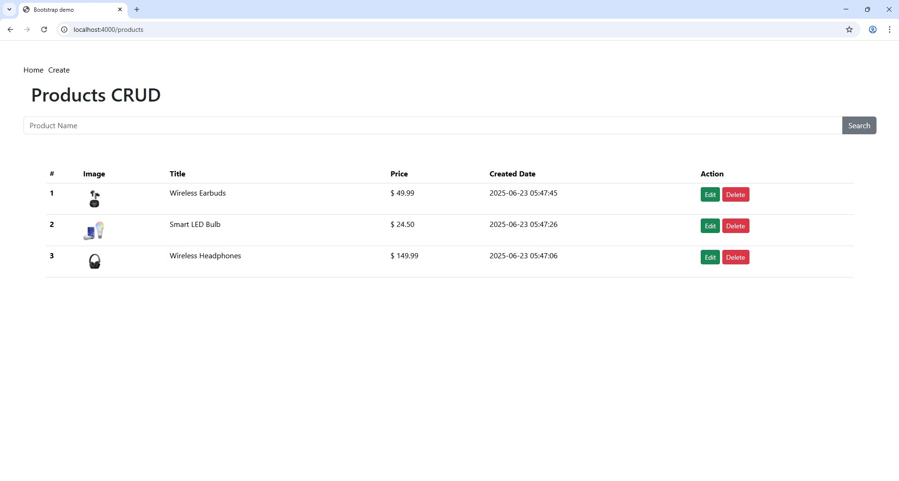
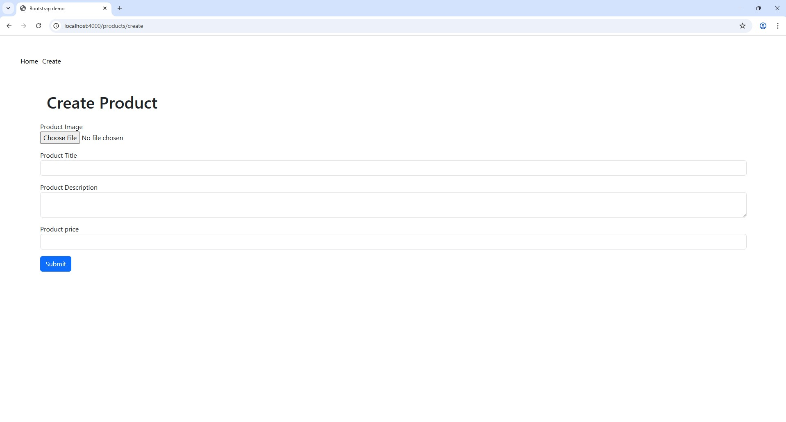
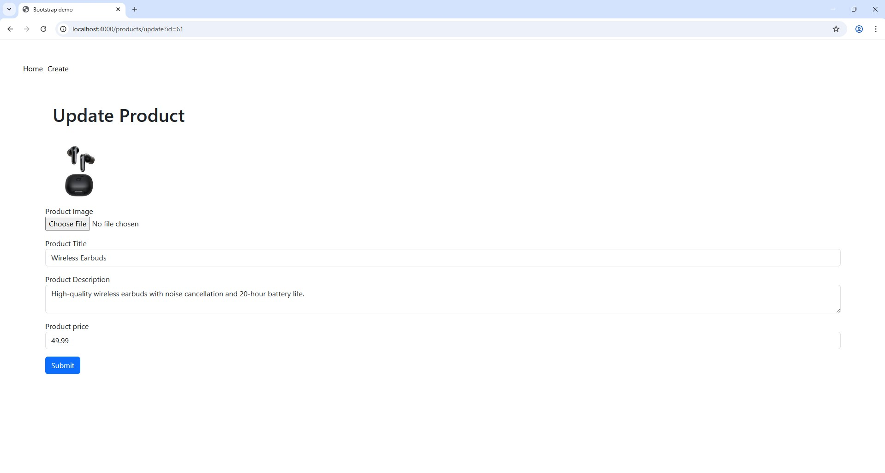
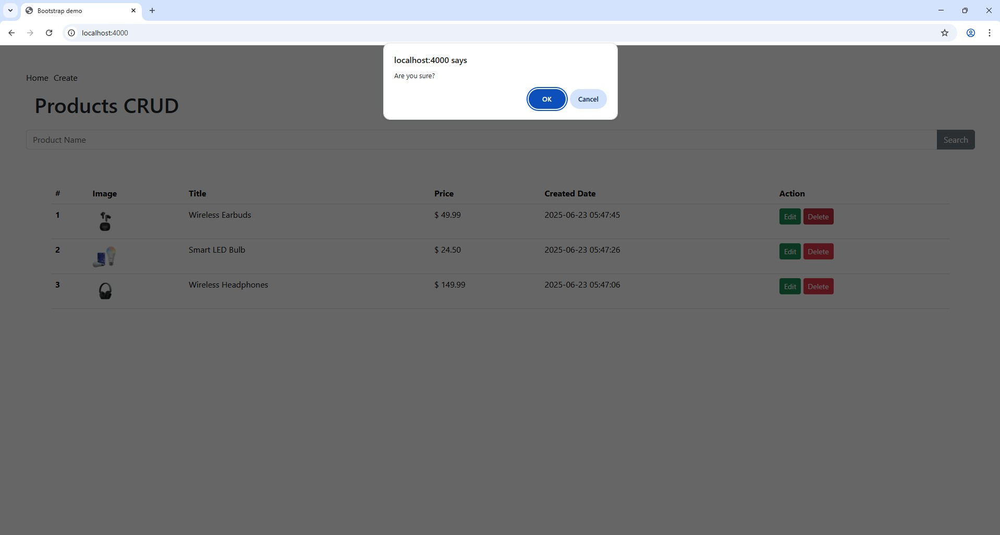

##  Project Overview

This is a minimal PHP CRUD application built with a lightweight custom MVC architecture and Twig as the templating engine. It allows users to upload and manage prescriptions, assign medicines with price calculation, and handle quotations through a simple accept/reject workflow.

##  Features Implemented

- Add new products with image upload
- Edit product details and images
- Delete products
- List all products with search functionality
- Backend validation and error handling
- Clean code structure following MVC pattern
- Dynamic UI with Twig templating

---

##  Setup Instructions

1. **Clone the project**
2. **Navigate to the project root**
3. **Install dependencies**
   ```bash
   composer install
   php -S localhost:8000 -t public
4. Configure the database
   - Create a MySQL database (e.g., product_crud_1)
   - Import the provided SQL file (e.g., database.sql)
   - Update DB credentials in core/Database.php or the relevant config file.

<p align="center">
  
  
  
  
</p>
